# Dell サイト構造（スクレイピング対象）

`scraping/scraping.spec.js` が巡回する Dell 日本公式サイトのページ構造メモです。  
セレクタ調査の出発点として使い、サイト改修時の差分確認に利用してください。

対象 URL:

```
https://www.dell.com/ja-jp/shop/scc/scr/laptops
```

---

## 巡回の全体像

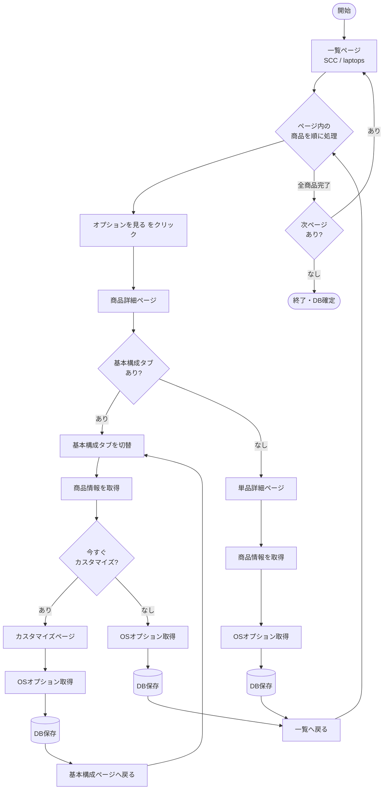

**処理の流れ（要約）**

1. ノート PC 一覧ページを開く
2. 各ページの商品カードを順に処理
3. 「オプションを見る」で商品詳細へ遷移
4. 基本構成の有無で分岐し、商品情報と OS オプション（Linux 等）を取得
5. 一覧 URL に戻る
6. 一覧のページネーションで次ページへ（最終ページまで繰り返し）

---

## ページ種別とページングの有無

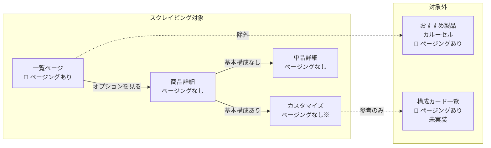

※ カスタマイズページ内の構成カード（`.card-deck-item`）にはページングが存在する場合がありますが、現行スクリプトでは巡回していません。

| ページ種別 | URL の例 | ページング | 備考 |
|------------|----------|:----------:|------|
| **一覧ページ（SCC）** | `/shop/scc/scr/laptops` | **あり** | 商品リスト全体のページ送り。現状 7 ページ・84 件程度 |
| **商品詳細（バリアントスタック）** | `/shop/.../spd/...?ref=variantstack` | なし | 基本構成タブ（`a.base-config-option`）で構成切替 |
| **カスタマイズページ** | 上記から「今すぐカスタマイズ」遷移後 | 条件付き | 構成カード一覧のページングは未巡回 |
| **単品詳細ページ** | `/shop/.../spd/...`（`cf-*` 系 UI） | なし | 基本構成タブがない商品 |
| **おすすめ製品カルーセル** | 一覧ページ内 | あり | スクレイピング対象外 |

### ページングがあるページの詳細

#### 1. 一覧ページ（メインのページング）

スクレイパーが実際にループするのはここだけです。

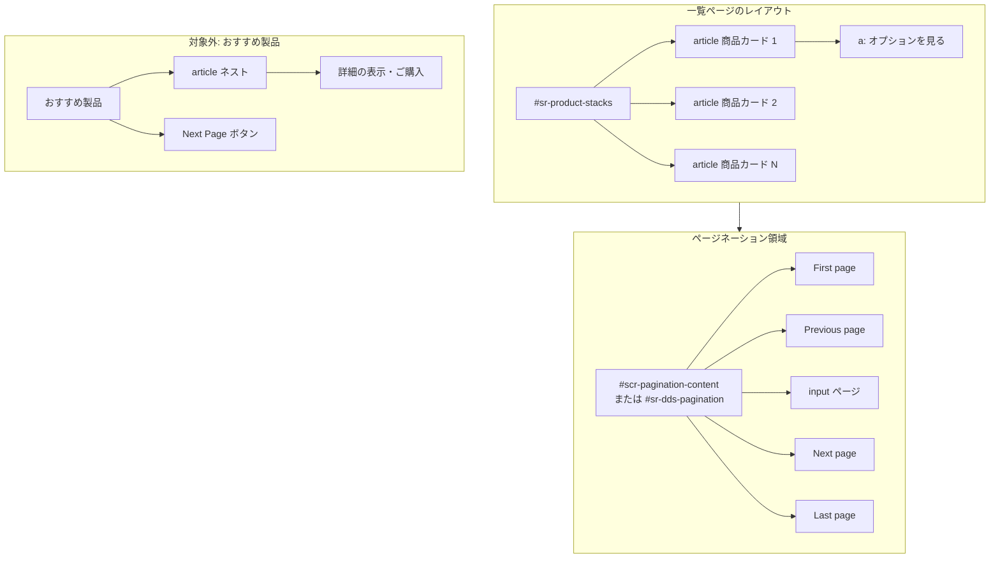

| 要素 | セレクタ |
|------|----------|
| ページネーション領域 | `#scr-pagination-content` または `#sr-dds-pagination` |
| 次へボタン | `button[aria-label="Next page"]` または `button.dds__pagination__next-page` |
| 前へボタン | `button.dds__pagination__prev-page` |
| 現在ページ入力 | `input[aria-label="ページ"]` |
| 終端判定 | 次へボタンの `disabled` または `aria-disabled="true"` |

表示例: `ページ [7] of 7`（テキストボックスに現在ページ、横に総ページ数）

#### 2. 一覧内「おすすめ製品」カルーセル（ページングあり・対象外）

一覧ページ下部付近に **別の** ページングがあります。商品リスト本体とは別物です。

| 要素 | 特徴 |
|------|------|
| 見出し | `おすすめ製品` |
| カルーセル内商品 | ネストされた `article`（「詳細の表示・ご購入」リンク） |
| カルーセル送り | `Next Page` / `Previous Page` ボタン |

スクレイパーは `#sr-product-stacks article` のうち **「オプションを見る」リンクを持つカードのみ** を対象とし、カルーセル内 `article` は除外しています。

#### 3. カスタマイズページ内（参考・未実装）

`scraping.md` に記載。カード型の構成一覧を複数ページに分けている場合があります。

| 要素 | セレクタ |
|------|----------|
| 構成カード一覧 | `.card-deck-item` |
| 次ページ（構成一覧） | `button[aria-label="Next page"]` |
| スペック | `.card-specs` |
| 価格 | `.sale-price` |

現行の `scraping.spec.js` はこのページングをループせず、表示中の 1 画面から OS オプションを取得します。

---

## ページ別 DOM 構造

### 一覧ページ

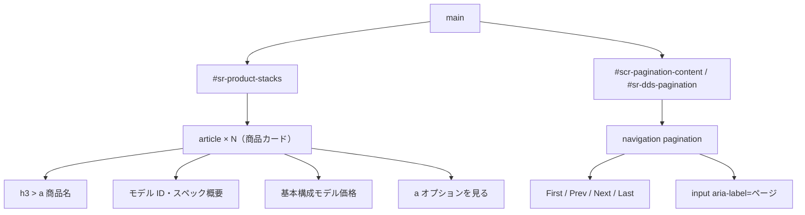

**商品カードの取得（Playwright）:**

```js
page.locator('#sr-product-stacks article').filter({
  has: page.locator('a.variant-customize-button, a:has-text("オプションを見る")'),
});
```

| 項目 | セレクタ・内容 |
|------|----------------|
| 商品リスト容器 | `#sr-product-stacks` |
| 商品カード | `article`（上記フィルタ後） |
| 詳細へ進むリンク（新 UI） | `a:has-text("オプションを見る")` |
| 詳細へ進むリンク（旧 UI） | `a.variant-customize-button` |
| 件数表示 | `84件中73～84件の結果` のようなテキスト（ページごとに変動） |

---

### 商品詳細ページ（基本構成あり）

「オプションを見る」遷移先。複数の基本構成（プリセット）を持つモデル向け。

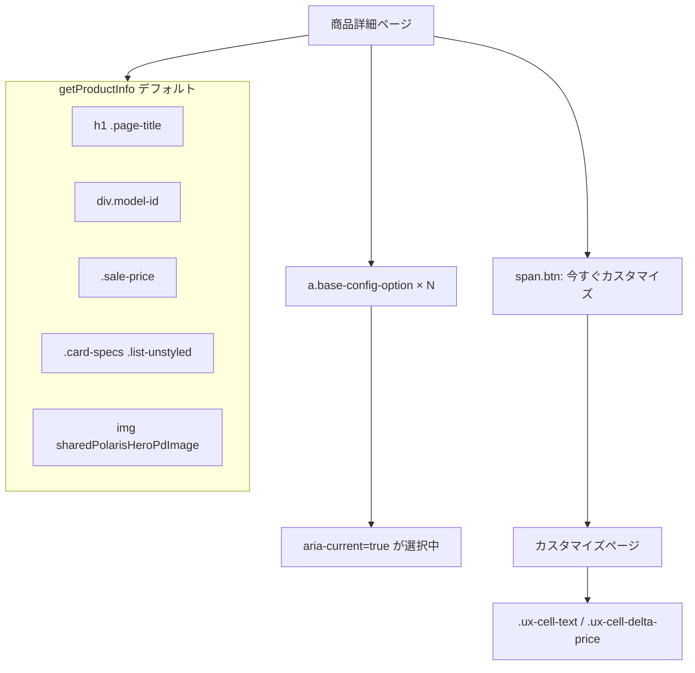

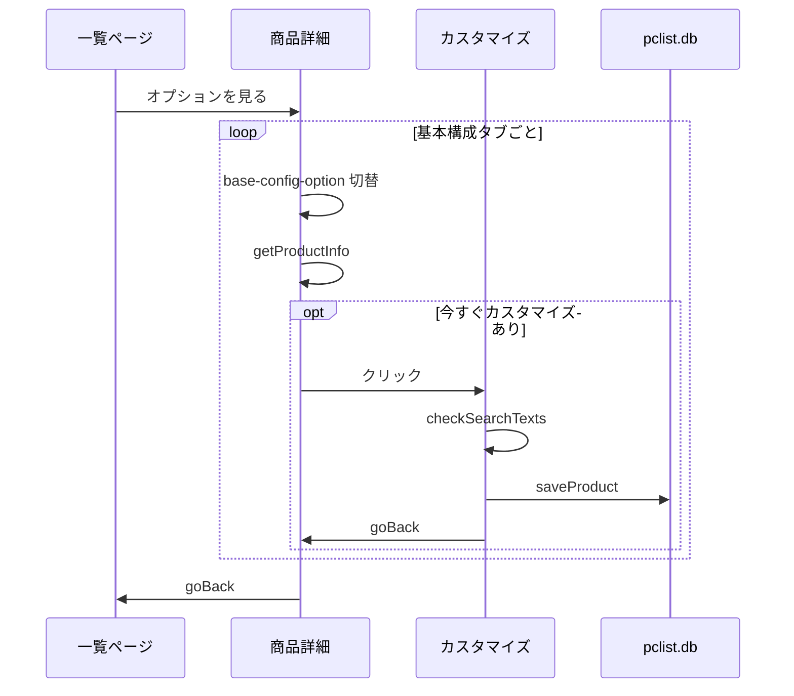

**処理の流れ:**

1. `a.base-config-option` が複数あればタブを切り替えながらループ
2. 各構成で `getProductInfo` 実行
3. 「今すぐカスタマイズ」があればクリックしてカスタマイズページへ
4. OS オプション（Linux / Ubuntu 等）を `checkSearchTexts` で検索
5. `goBack` で基本構成ページ → 一覧へ戻る

---

### カスタマイズページ

「今すぐカスタマイズ」後の構成選択画面。OS や各種オプションの価格差分を取得する。

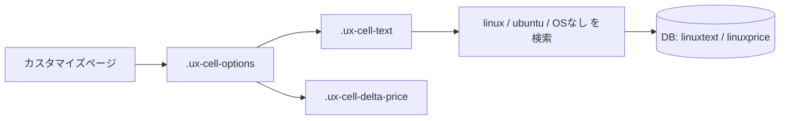

| 項目 | セレクタ |
|------|----------|
| オプション行（テキスト） | `.ux-cell-text` |
| オプション価格差分 | `.ux-cell-delta-price` |
| オプション領域（参考） | `.ux-cell-options` |

**検索キーワード（OS 関連）:**

```js
['linux', 'ubuntu', 'オペレーティングシステムなし']
```

`.ux-cell-text` のテキストに上記のいずれかが含まれる行を探し、同じ親要素内の `.ux-cell-delta-price` を価格として取得します。

---

### 単品詳細ページ（基本構成なし）

`a.base-config-option` も「今すぐカスタマイズ」も無い場合の分岐。

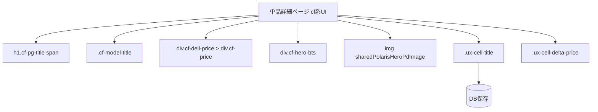

| 項目 | セレクタ |
|------|----------|
| 商品名 | `h1.cf-pg-title span` |
| モデル | `.cf-model-title` |
| 価格 | `div.cf-dell-price > div.cf-price` |
| スペック概要 | `div.cf-hero-bts` |
| 画像 | `img[data-testid='sharedPolarisHeroPdImage']` |
| OS オプション行 | `.ux-cell-title` |
| OS 価格差分 | `.ux-cell-delta-price` |

---

## 全ページ共通の割り込み UI

`popup-handler.js` が処理する要素です。一覧・詳細のどちらでも出現します。

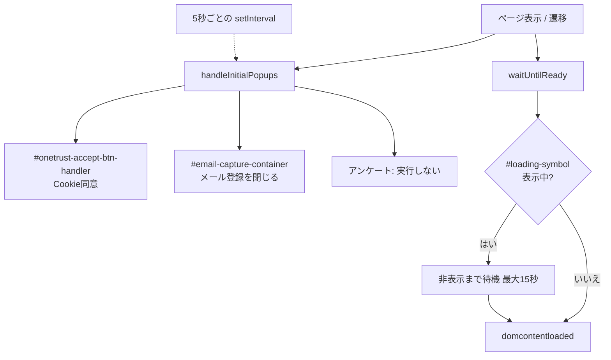

| 種類 | セレクタ | 操作 |
|------|----------|------|
| Cookie 同意 | `#onetrust-accept-btn-handler` | クリック（すべて同意） |
| メール登録ポップアップ | `#email-capture-container` | 閉じるボタン / Escape / DOM 除去 |
| メール閉じるボタン | `#email-capture-container button[aria-label="close"]` 等 | クリック |
| アンケート | `.QSIWebResponsive-creative-container-fade button`（テキスト: 実行しない） | クリック |
| ローディング表示 | `#loading-symbol` | 非表示になるまで待機（最大 15 秒） |

5 秒間隔の `setInterval` でも `handleInitialPopups` が呼ばれ、遷移中のポップアップを継続的に閉じます。

---

## ナビゲーションと戻り方

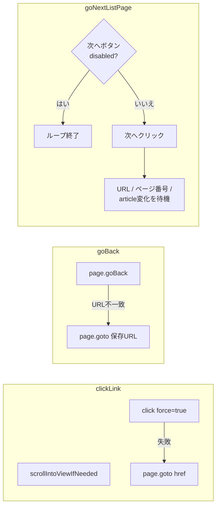

| 処理 | 実装 |
|------|------|
| リンククリック | `clickLink` — クリック失敗時は `href` から `page.goto` |
| ブラウザ戻る | `goBack(page, url)` — `page.goBack()` 後、URL が一致しなければ `page.goto(url)` |
| 一覧の次ページ | `goNextListPage` — 次へクリック後、URL・ページ番号・先頭 article テキストの変化を最大 10 秒待つ |

**一覧へ戻るタイミング:** 各商品の詳細取得が終わるたびに、ループ開始時に保存した `currenturl`（一覧ページ URL）へ `goBack` します。

---

## 収集データと DB 項目の対応

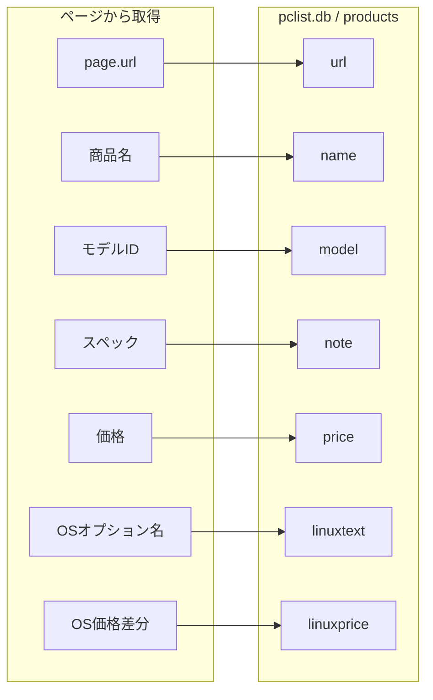

| DB カラム | 取得元 |
|-----------|--------|
| `url` | 保存時点の `page.url()`（カスタマイズ後 URL になる場合あり） |
| `name` | 商品名セレクタ |
| `model` | モデル ID セレクタ |
| `note` | スペック（`extractNoteText` でリストを 1 文字列に整形） |
| `price` | 価格（`,` `円` を除去） |
| `linuxtext` | OS オプション行テキスト |
| `linuxprice` | OS オプション価格差分（`,` `円` を除去） |

---

## 関連ファイル

| ファイル | 役割 |
|----------|------|
| `scraping/scraping.spec.js` | メインの巡回・取得ロジック |
| `scraping/popup-handler.js` | ポップアップ・ローディング待ち |
| `scraping/pclist-db.js` | SQLite への保存 |
| `scraping/text-search.js` | テキスト検索ユーティリティ（補助） |
| `scraping.md` | セレクタの初期メモ（旧 UI 中心） |

---

## サイト改修時のチェックポイント

1. **一覧の詳細リンク** — `a.variant-customize-button` から `オプションを見る` テキストリンクへの変更があった（両方に対応済み）
2. **ページネーション容器 ID** — `#scr-pagination-content` と `#sr-dds-pagination` の二系統（両方に対応済み）
3. **カルーセル混入** — `#sr-product-stacks article` だけではおすすめ製品が含まれるため、リンクでのフィルタが必要
4. **基本構成 UI** — `a.base-config-option` / `今すぐカスタマイズ` の有無で分岐が変わる
5. **タイムアウト** — 全件巡回には 60 分以上かかる場合がある（商品数・構成数に依存）
